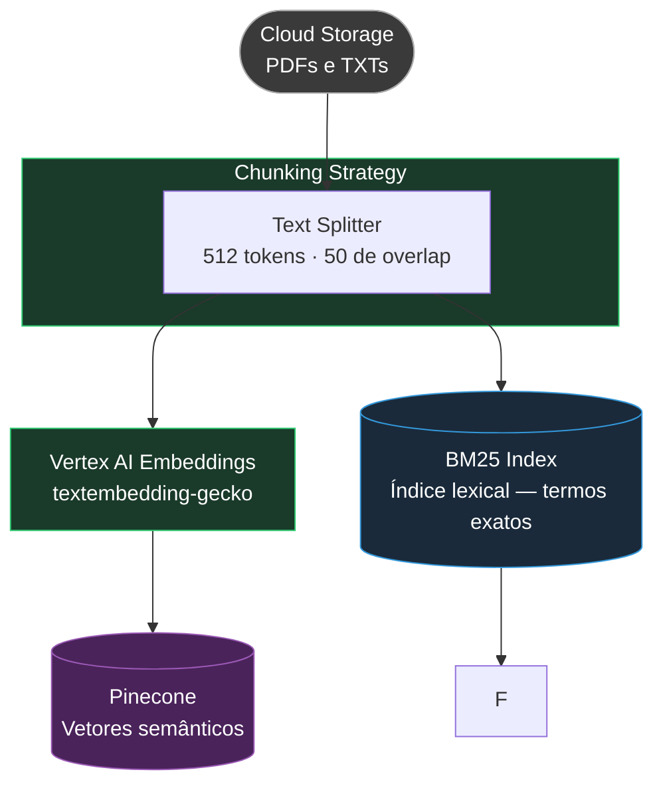
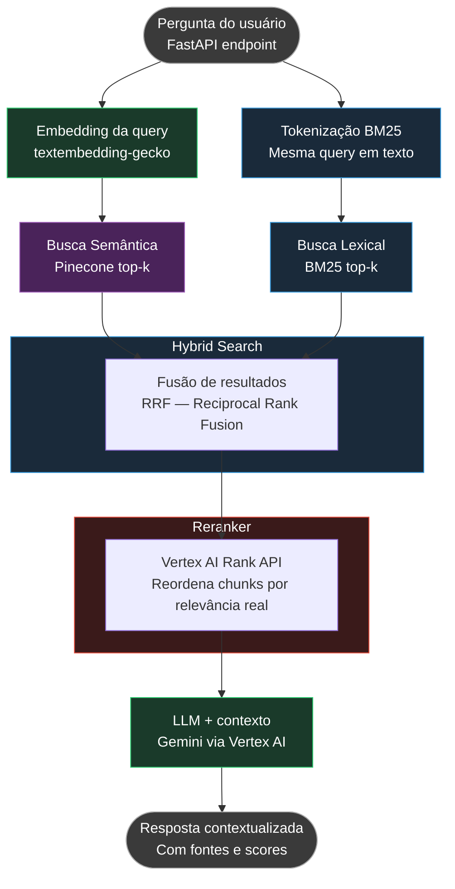

# RAG Pipeline — Arquitetura Completa

## Pipeline de Ingestão



---

## Pipeline de Consulta (RAG)



---

## Componentes — Responsabilidade de cada bloco

| Bloco | Tecnologia | Por quê |
|---|---|---|
| Cloud Storage | GCP Cloud Storage | Fonte dos documentos brutos (PDF, TXT) |
| Text Splitter | LangChain `RecursiveCharacterTextSplitter` | Chunking com 512 tokens e 50 de overlap para preservar contexto entre chunks |
| Vertex AI Embeddings | `textembedding-gecko` | Gera vetores densos para busca semântica |
| Pinecone | Vector DB gerenciado | Armazena e consulta vetores por similaridade coseno |
| BM25 Index | `rank_bm25` (Python) | Índice esparso para busca lexical — captura nomes próprios e termos exatos |
| Hybrid Fusion | RRF (Reciprocal Rank Fusion) | Combina rankings semântico + lexical sem precisar de pesos manuais |
| Reranker | Vertex AI Rank API | Reordena os top-k fundidos por relevância real em relação à query |
| LLM | Gemini via Vertex AI | Gera a resposta final usando os chunks rerankeados como contexto |

---

## Por que cada adição importa

### Chunking Strategy (512 tokens · 50 overlap)
- Chunks muito grandes → perdem foco, o LLM dilui o contexto relevante
- Chunks muito pequenos → perdem coerência semântica
- O overlap de 50 tokens garante que frases na borda de um chunk não se percam

### Hybrid Search (BM25 + Pinecone)
- Busca semântica falha em nomes próprios, siglas e termos muito específicos
- BM25 é exato por definição — captura o que a busca vetorial perde
- RRF funde os dois rankings sem precisar calibrar pesos

### Reranker (Vertex AI Rank API)
- top-k por similaridade coseno retorna os vetores mais próximos, não necessariamente os mais úteis
- O reranker avalia cada chunk no contexto exato da query, com precisão maior
- Reduz alucinação do LLM ao filtrar chunks periféricos antes de montar o contexto
```
